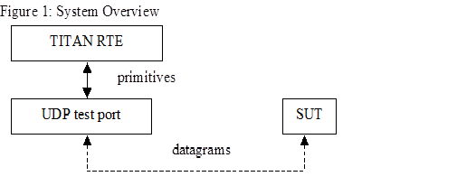

= UDP Socket Test Port for TTCN-3 Toolset with TITAN, Function Specification
:author: Gábor Szalai
:revnumber: 155 17-CNL 113 346, Rev. C
:revdate: 2004-09-07
:toc:

== How to Read This Document

This is the Function Specification for the UDP test port. The UDP test port is developed for the TTCN-3 Toolset with TITAN according to the Requirement Specification <<_5, [5]>>. This document is intended to be read together with the User’s Guide <<_3, [3]>>.

== Scope

The purpose of this document is to specify the functionality of the UDP test port. The document is primarily addressed to the end users of the product. Basic knowledge of TTCN-3 and TITAN TTCN-3 Test Executor is valuable when reading this document (see <<_1, [1]>> and <<_2, [2]>>).

This document is based on specifications of User Datagram Protocol (UDP) defined by RFC 768 <<_5, [5]>>.

= General

The UDP Test Port makes it possible to execute test suites towards a SUT. The test port offers UDP primitives to the test suite and communicates with the SUT.

The communication between the UDP test port and the TITAN RTE is done by using the API functions described in <<_2, [2]>>. The UDP protocol messages are then transferred by the UDP test port to the SUT.

See the overview of the system below:

= Function Specification

== Implementation

The UDP layer is implemented in UNIX kernel. The test port implements the communication between UNIX UDP sockets and the TTCN-3 UDP ASPs.

=== Module Structure

The UDP test port is implemented in the following TTCN-3 blocks:

* __UDPasp_Types.ttcn__
* __UDPasp_PortType.ttcn__

The file __UDPasp_Types.ttcn__ defines the UDP ASPs. The port type is defined in __UDPasp_PortType.ttcn__.

The C++ implementation of the test port is contained in the following files:

* __UDPasp_PT.hh__
* __UDPasp_PT.cc__

== Configuration

The configuration of the UDP test port is done by the TITAN RTE configuration file. The description of the specific parameters can be found in the UDP test port user’s guide <<_3, [3]>>.

== Operation Mode

There are two operation modes of the test port

* Basic mode: +
The test port provides a simple ASP interface towards the TITAN RTE. This interface is compatible with the previous versions of the test port interface.
* Advanced mode: +
The advanced ASP interface provides the following port operations: open socket, close socket, send and receive data. One test port can handle multiple UDP sockets.

== Start Procedure

After the configuration is done, the user has to make sure that the target system is up and running. When the executable test suite is started it initializes the UDP socket. After the initialization is ready, the transmission of the ASPs can begin.

[[sending-receiving-udp-asps]]
== Sending/Receiving UDP ASPs

When the communication between the UDP test port and the target system is set up, the test port starts transferring the UDP primitives towards the TITAN RTE and UDP datagrams towards the SUT.

=== UDP ASPs Sent by the Test Port

The UDP test port is able to send the following UDP primitives in basic mode:

* `ASP_UDP`

The UDP test port is able to send the following UDP primitives in advanced mode:

* `ASP_UDP_message`
* `ASP_UDP_open_result`

=== UDP ASPs Received by the Test Port

The UDP test port is able to receive the following type of UDP primitives in *basic mode*:

* `ASP_UDP`

The UDP test port is able to receive the following type of UDP primitives in *advanced mode*:

* `ASP_UDP_message`
* `ASP_UDP_open`
* `ASP_UDP_close`

== Logging

The type of information that will be logged can be categorized into two groups. The first one consists of information that shows the flow of the internal execution of the test port, for example, important events, which function that is currently executing etc. The second group deals with presenting valuable data, for example, presenting the content of a PDU. The logging printouts will be directed to the RTE log file. The user is able to decide whether logging is to take place or not by setting appropriate configuration data, see <<_3, [3]>>.

== Error Handling

Erroneous behavior detected during runtime is shown on the console and directed into the RTE log file. The following two types of messages are handled:

* Errors: +
Information about errors detected is provided. If an error occurs the execution of the test case will stop immediately and the socket will be closed.
* Warnings: +
Information about warnings detected is provided. The execution continues after the warning is shown.

== Closing Down

After the test port has executed all test cases it stops automatically. It closes down the UDP socket towards the SUT and terminate.

The execution of the test suite can be stopped at any time by pressing `<Ctrl>-c`. Before the executable terminates the socket is closed down.

== Limitations

The operating system is Solaris 5.8.

The maximal length of the UDP data is 65536 bytes.

= Terminology

None.

= Abbreviations

API:: Application Programming Interface

ASP:: Abstract Service Primitive

RTE:: Run-Time Environment

SUT:: System Under Test

TTCN-3:: Testing and Test Control Notation version 3

UDP:: User Datagram Protocol

= References

[[_1]]
[1] ETSI ES 201 873-1 (2002) +
The Testing and Test Control Notation version 3. Part 1: Core Language

[[_2]]
[2] User Documentation for the TITAN TTCN-3 Test Executor

[[_3]]
[3] UDP Socket Test Port for TTCN-3 Toolset with TITAN, User Guide

[[_4]]
[4] Functional Test System Requirement Specification for GSN

[[_5]]
[5] https://tools.ietf.org/html/rfc768[RFC 768] (1980) +
User Datagram Protocol
