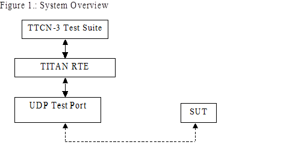
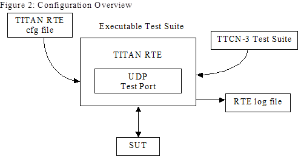

= UDP Socket Test Port for TTCN-3 Toolset with TITAN, User's Guide
:author: Gábor Szalai
:revnumber: 198 17-CNL 113 346, Rev. E
:revdate: 2007-01-24
:toc:

== About This Document

=== How to Read This Document

This is the User’s Guide for the UDP test port. The UDP test port is developed for the TTCN-3 Toolset with TITAN according to the Requirement Specification <<_4, ‎[4]>>. This document is intended to be read together with Function Specification <<_3, ‎[3]>>.

=== Prerequisite Knowledge

The knowledge of the TITAN TTCN-3 Test Executor ‎<<_2, [2]>> and the TTCN-3 language <<_1, ‎[1]>> is essential. Basic knowledge of the UDP protocol is valuable when reading this document.

== System Requirements

In order to operate the UDP test port the following system requirements must be satisfied:

* Platform: Solaris 5.8
* TITAN TTCN-3 Test Executor version R7A (1.7.pl0) or higher installed. For installation guide see <<_2, ‎[2]>>.

NOTE: This version of the test port is not compatible with TITAN releases earlier than R7A.
The same C compiler gcc version installed which the TITAN was compiled with. See the Release Notes of TITAN.

For other known limitations please see the FS ‎<<_3, [3]>>.

== Fundamental Concepts

The test port establishes UDP connection between the TTCN-3 test executor and the SUT. The test port transmits and receives UDP protocol messages between the TITAN RTE and the SUT.

= The Test Port

== Overview

The UDP test port offers UDP primitives to the test suite in TTCN-3 format. The TTCN-3 definition of the ASPs can be found in a separate TTCN-3 module. This module must be imported into the test suite.

The test port transfers UDP primitives towards the TITAN RTE and UDP datagrams towards the SUT.

See the overview of the test system below:

== Installation

Since the UDP test port is used as a part of the TTCN-3 test environment this requires TTCN-3 Test Executor to be installed before any operation of the UDP test port. For more details on the installation of TTCN-3 Test Executor see the relevant section of ‎<<_2, [2]>>.

When building the executable test suite the libraries provided for the TTCN-3 Test Executor should also be linked into the executable. For more information see also ‎<<_2, [2]>>.

== Operation Modes

=== Basic Mode

==== Description

In basic mode the port provides a simple ASP interface and can handle only one UDP socket. The local IP address and port number can be configured only via config file. This mode is compatible with the previous release of the port. Only the basic ASP can be used.

==== ASP Definition

`ASP_UDP` – send and receive data

=== Advanced Mode

[[description-0]]
==== Description

In advanced mode the test port provides the following functionality:

* open socket
* close socket
* send and receive data

The port can handle several UDP sockets. The local IP address and port numbers are configured in run time via ASPs. Only the advanced ASP can be used.

[[asp-definition-0]]
==== ASP Definition

`ASP_UDP_message` – send and receive data

`ASP_UDP_open` – request a new socket

`ASP_UDP_open_result` – the result of the open request

`ASP_UDP_close` – close the socket

== Configuration

The executable test program behavior is determined via the RTE configuration file. This is a simple text file, which contains various sections (e.g. `[TESTPORT_PARAMETERS]`) after each other. The usual suffix of the RTE configuration file is _.cfg_. For further information about the configuration file see ‎<<_2, [2]>>.

See the overview of the configuration process below:

=== UDP Test Port Parameters in the RTE Configuration File

In the `[TESTPORT_PARAMETERS]` section you can specify parameters that are passed to the test ports. Each parameter definition consists of a component name, a port name, a parameter name and a parameter value. The component name can be either an identifier or a component reference (integer) value. The port and parameter names are identifiers while the parameter value always must be a charstring (with quotation marks). Instead of component name or port name (or both of them) the asterisk ("*") sign can be used, which means "all components" or "all ports of the component". More information about the RTE configuration file can be found in ‎<<_2, ‎[2]>>.

In the `[TESTPORT_PARAMETERS]` section the following parameters can be set for the UDP test port:

* `mode`
+
This sets the port operation mode.
+
Possible values:
+
--
** `_"basic"_` - Basic operation mode
** `_"advanced"_` - Advanced operation mode
--
+
The default mode is the `_"basic"_` operation mode.

* `localIPAddr`
+
This identifies the IP address of the local host. Only IPv4 is supported.
+
Possible values of this parameter are:
+
IP address in IPv4 format or the host name like: `_"127.0.0.1"_` or `_"localhost"_`.
+
The default is `_"all network"_`.
+
Used only in basic mode.

* `localPort`
+
This gives the local port number where the test port receives datagrams.
+
The default is `_"50000"_`.
+
Used only in basic mode.

* `debugging`
+
Activates/deactivates logging in the test port.
+
Possible values are:
+
--
** `_"no"_` - Logging is not active
** `_"yes"_` - Logging is active
--
+
The default value is `_"no"_`.
+
In the RTE configuration file it is possible to define the name and path of the RTE log file. Debug output from the test port is written into the RTE log file. If no path is given in the configuration file, the RTE log file is stored in the working directory.

* `broadcast`
+
Enables/disables the broadcast sending capabilities of the test port.
+
--
** `_"enabled"_` Broadcast sending is enabled
** `_"disable"_` Broadcast sending is disabled
--
+
The default value is `_"disabled"_`.

== Start Procedure

=== TTCN-3 Test Executor

Before the executable test suite can be run the TTCN-3 modules and C++ codes should be compiled and linked into an executable program. This process can be automated using the `make` utility. The way how the _Makefile_ should be generated is described in ‎<<_2, ‎[2]>>.

NOTE: The C++ implementation files __UDPasp_PT.hh__ and __UDPasp_PT.cc__ of the test port must be included in the _Makefile_.

If the executable test suite is ready, run it giving the RTE configuration file as argument in your terminal:

[source]
Home> ExecutabletestSuite RTEConfigurationFile.cfg

For more information, see ‎‎<<_2, [2]>>.

== Sending UDP ASPs

[[basic-mode-0]]
=== Basic Mode

At `send` operation the `addressf` and `portf` must contain the remote host IP address and port number. The IP address can be given either as the remote hostname (ex: `localhost`) or in IPv4 format (ex: 127.0.0.1).

The `data` field should contain the datagram to be sent.

[[advanced-mode-0]]
=== Advanced Mode

==== Open a New Socket

The opening of a new socket is requested by the sending of the `ASP_UDP_open` message to the test port. The `local_addr` contains the local IP address or hostname. If it is omitted the default is any address. The `local_port` contains the local port number. If omitted a random port number will be used.

The `remote_addr` and `remote_port` contain the address and port number of the remote host. If specified this address will be the default remote address for the socket.

The test port answers the `open` request with the `ASP_UDP_open_result`.

==== Sending Data

The data sending is requested with the `ASP_UDP_message` message.

The `remote_addr` and `remote_port` can contain the address and port number of the remote host. If specified this address will be used and overwrite the default remote address for the socket. If omitted the default remote address will be used. They are mandatory if no socket id specified.

The _id_ specifies the socket used during data sending. If omitted the port will open a socket for the data sending. This socket will be closed after the send is completed.

The `data` field should contain the datagram to be sent.

[[close-the-socket]]
==== Close the Socket

The `close` operation is requested by the `ASP_UDP_close` message.

The _id_ identifies the socket to be closed.

== Receiving UDP ASPs

[[basic-mode-1]]
=== Basic Mode

At `receive` operation the `addressf` and `portf` contain the remote host IP address and port number. The IP address is given in IPv4 format (ex: 127.0.0.1).

The `data` field contains the received datagram.

[[advanced-mode-1]]
=== Advanced Mode

==== Open Result

The `open` request is answered with `ASP_UDP_open_result` message. It carries the details of the opened socket.

The `local_addr` contains the local IP address. The `local_port` contains the port number.

The _id_ is the unique identifier of the socket.

==== Receiving Data

The data receiving is indicated via `ASP_UDP_message` message.

At receive operation the `remote_addr` and `remote_port` contain the remote host IP address and port number. The IP address is given in IPv4 format (ex: 127.0.0.1).

The _id_ contains the unique id of the socket that received the data.

The `data` field contains the received datagram.

== Stop Procedure

[[ttcn-3-test-executor-0]]
=== TTCN-3 Test Executor

The test port should stop automatically after it finished the execution of all test cases. It closes down the open UDP sockets towards the SUT and terminates.

The execution of the test suite can be stopped at any time by pressing `<Cntr>-c`. It will shut down the socket and terminate.

= Examples

== Configuration File

An example RTE configuration file is shown below:

[source]
----
[LOGGING]
LogFile := "UDPtest.log"
FileMask := LOG_ALL | TTCN_DEBUG | TTCN_MATCHING
ConsoleMask := TTCN_ERROR | TTCN_WARNING | TTCN_TESTCASE | TTCN_STATISTICS | TTCN_PORTEVENT
LogSourceInfo := Yes

[EXECUTE]
UDPtest.tc1

[TESTPORT_PARAMETERS]
*.UDP1.debugging := "yes"
*.UDP1.localPAddr := "localhost"
*.UDP1.localPort := "5679"
*.UDP2.debugging := "yes"
*.UDP2.localPAddr := "localhost"
*.UDP2.localPort := "5678"
----

= Error Messages

The error messages have the following general form:

[source]
Dynamic test case error: <error text>

Error messages are written into the log file. In the log file a time stamp is also given before the message text.

The list of the possible error messages is shown below. Note that this list contains the error messages produced by the test port. The error messages coming from the TITAN are not shown:

`*<Parameter Name> is not defined in the configuration file*`

Mandatory parameter is missing from the configuration file.

`*Error when reading the received UDP PDU.*`

An error occurred when a UDP PDU was received.

`*Cannot open socket*`

The socket system call fails.

`*Cannot bind port*`

The bind system call fails.

`*Sendto system call failed: <n> bytes was sent instead of <m>*`

The `sendTo` system call fails.

`*The host name <name> is not valid.*`

The specified host name is not a valid host name.

`*No remote host name specified.*`

The remote host name is not specified and there is no default remote host to send the data.

`*No remote port specified.*`

The remote port is not specified and there is no default port to send the data.

= Warning Messages

The following list shows the possible warning messages produced by the test port:

`*UDPasp__PT::set_parameter() : Unsupported Test Port parameter <parameter>.*`

The parameter set in the configuration file is unknown for the UDP test port.

= Terminology

None.

= Abbreviations

ASP:: Abstract Service Primitive

RTE:: Run-Time Environment

SUT:: System Under Test

TTCN-3:: Testing and Test Control Notation version 3

UDP:: User Datagram Protocol

= References

[[_1]]
[1] ETSI ES 201 873-1 (2002) +
The Testing and Test Control Notation version 3. Part 1: Core Language

[[_2]]
[2] User Documentation for the TITAN TTCN-3 Test Executor

[[_3]]
[3] UDP Socket Test Port for TTCN-3 Toolset with TITAN, Function Specification

[[_4]]
[4] Functional Test System Requirement Specification for GSN

[[_5]]
[5] https://tools.ietf.org/html/rfc768[RFC 768] (1980) +
User Datagram Protocol
